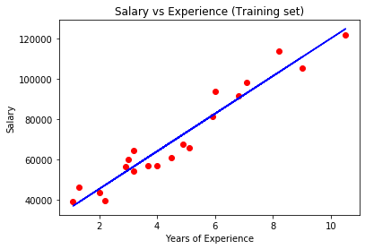
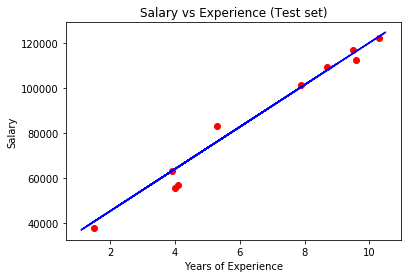

# Maching Learning 

###  [Simple Lineal Regression](#1-simple_lineal_regression)
###  [Multiple linear Regression](#2-multiple_linear_regression)
###  [Polynomial Regression](#3-polynomial_regression)
###  [Support Vector Regression (SVR)](#4-support_vector_regression_(svr))
---

## 1. Simple_Lineal_Regression

This project demonstrates how to implement Simple Linear Regression using Python and scikit-learn. The model predicts employee salaries based on their years of experience.

### Importing the libraries
```
import numpy as np
import matplotlib.pyplot as plt
import pandas as pd  # clase para cargar los datos 
```
### Importing the dataset

The dataset used is Salary_Data.csv, which includes:
YearsExperience: Number of years an employee has worked.
Salary: The corresponding annual salary.

```
dataset = pd.read_csv('Salary_Data.csv')
X = dataset.iloc[:, :-1].values
y = dataset.iloc[:, -1].values
```

### Splitting the dataset into the Training set and Test set
```
from sklearn.model_selection import train_test_split
X_train, X_test, y_train, y_test = train_test_split(X, y, test_size = 0.2, random_state = 0)
```
### Training the Simple Linear Regression model on the Training set
```
from sklearn.linear_model import LinearRegression
regressor = LinearRegression()
regressor.fit(X_train, y_train)
```
### Predicticting Test Results
```
y_pred = regressor.predict(X_test)
```
### Visualising the training set result
```
plt.scatter(X_train, y_train, color = 'red')
plt.plot(X_train, regressor.predict(X_train), color = 'blue')
plt.title('Salary vs Experience (Training set)')
plt.xlabel('Years of Experience')
plt.ylabel('Salary')
plt.show()
```


### Vusualising the Test set Results
```
plt.scatter(X_test, y_test, color = 'red')
plt.plot(X_train, regressor.predict(X_train), color = 'blue')
plt.title('Salary vs Experience (Test set)')
plt.xlabel('Years of Experience')
plt.ylabel('Salary')
plt.show()
```



## 2. Multiple_linear_Regression 
## Importing Dataset
```
dataset = pd.read_csv('50_Startups.csv')
X = dataset.iloc[:, :-1].values
y = dataset.iloc[:, -1].values
```
## Encoding Categorical Data
```  
from sklearn.compose import ColumnTransformer
from sklearn.preprocessing import OneHotEncoder
ct = ColumnTransformer(transformers=[('encoder', OneHotEncoder(), [3])], remainder='passthrough')
X = np.array(ct.fit_transform(X))
```
## Spliting the dataset into the training set and Test set
```
from sklearn.model_selection import train_test_split
X_train, X_test, y_train, y_test = train_test_split(X, y, test_size = 0.2, random_state = 0)
```
## Training the dataset into the training set and test set 
```
from sklearn.linear_model import LinearRegression
regressor = LinearRegression()
regressor.fit(X_train, y_train)
```
## Predicting test results 
```
y_pred = regressor.predict(X_test)
np.set_printoptions(precision=2)
print(np.concatenate((y_pred.reshape(len(y_pred),1), y_test.reshape(len(y_test),1)),1))


[[103015.2  103282.38]
 [132582.28 144259.4 ]
 [132447.74 146121.95]
 [ 71976.1   77798.83]
 [178537.48 191050.39]
 [116161.24 105008.31]
 [ 67851.69  81229.06]
 [ 98791.73  97483.56]
 [113969.44 110352.25]
 [167921.07 166187.94]]
```

## 3. Polynomial_Regression 

This project demonstrates how to apply **Polynomial Regression** to predict salaries based on job position levels. The aim is to show how polynomial regression can capture nonlinear relationships in data more accurately than simple linear regression.

---

### 🧠 Project Summary

We explore the difference between:

- **Linear Regression**: Fits a straight line to the data.
- **Polynomial Regression**: Fits a curved line that better adapts to complex patterns in the dataset.

We use a fictional dataset where salary increases with position level in a nonlinear way.

---

### 📂 Dataset

The dataset used is `Position_Salaries.csv`, which contains:

- `Position`: The job title (not used in modeling)
- `Level`: Numerical value representing job hierarchy
- `Salary`: Corresponding salary

---

### 📌 Libraries Used

```python
import numpy as np
import matplotlib.pyplot as plt
import pandas as pd
from sklearn.linear_model import LinearRegression
from sklearn.preprocessing import PolynomialFeatures

```


🛠️ Steps
🔹 1. Import the Dataset
```

dataset = pd.read_csv('Position_Salaries.csv')
X = dataset.iloc[:, 1:-1].values
y = dataset.iloc[:, -1].values
```
🔹 2. Train Linear Regression Model
```
lin_reg = LinearRegression()
lin_reg.fit(X, y)
```
🔹 3. Train Polynomial Regression Model
```
poly_reg = PolynomialFeatures(degree=4)
X_poly = poly_reg.fit_transform(X)
lin_reg_2 = LinearRegression()
lin_reg_2.fit(X_poly, y)
```
🔹 4. Visualize Results
Linear Regression:
```
plt.scatter(X, y, color='red')
plt.plot(X, lin_reg.predict(X), color='blue')
plt.title('Truth or Bluff (Linear Regression)')
plt.xlabel('Position Level')
plt.ylabel('Salary')
plt.show()
```


Polynomial Regression (Standard):
```
plt.scatter(X, y, color='red')
plt.plot(X, lin_reg_2.predict(poly_reg.fit_transform(X)), color='blue')
plt.title('Truth or Bluff (Polynomial Regression)')
plt.xlabel('Position Level')
plt.ylabel('Salary')
plt.show()
```
Polynomial Regression (Smooth Curve):
```
X_grid = np.arange(min(X), max(X), 0.1)
X_grid = X_grid.reshape((len(X_grid), 1))
plt.scatter(X, y, color='red')
plt.plot(X_grid, lin_reg_2.predict(poly_reg.fit_transform(X_grid)), color='blue')
plt.title('Truth or Bluff (Polynomial Regression)')
plt.xlabel('Position Level')
plt.ylabel('Salary')
plt.show()
```
🔹 5. Make Predictions
# Predict with Linear Regression
lin_reg.predict([[6.5]])  # → array([330378.78787879])

# Predict with Polynomial Regression
lin_reg_2.predict(poly_reg.fit_transform([[6.5]]))  # → array([158862.45265155])
📊 Result
The Linear Regression model overestimates the salary at level 6.5, while the Polynomial Regression model provides a more realistic prediction, showcasing the advantage of using non-linear models for non-linear data.

📁 Folder Structure
Copy
Edit
.
├── Position_Salaries.csv
├── polynomial_regression.py / .ipynb
├── README.md
└── requirements.txt
📦 Requirements
To install the required libraries:

bash
Copy
Edit
pip install -r requirements.txt
requirements.txt example:

nginx
Copy
Edit
numpy
pandas
matplotlib
scikit-learn

## 4. Support_Vector_Regression_(SVR)
This project demonstrates how to implement Support Vector Regression (SVR) using Python and scikit-learn. The model is trained to predict salaries based on position levels from a sample dataset.

### 📁 Dataset
The dataset used is Position_Salaries.csv, which contains the following columns:

Position (e.g., Business Analyst, Manager)

Level (numeric level of the position)

Salary (target variable)

Make sure the dataset file is located in the same directory as the script.

### 🔧 Requirements
To run this example, you need the following Python libraries:

bash
Copy
Edit
pip install numpy pandas matplotlib scikit-learn
🚀 How It Works
Importing Libraries: Loads the necessary Python libraries for data processing, visualization, and machine learning.

Loading the Dataset: Reads the CSV file and extracts the features (X) and target variable (y).

Feature Scaling: Since SVR does not automatically handle feature scaling, both X and y are scaled using StandardScaler.

Model Training: The SVR model with an RBF kernel is trained on the entire dataset.

Prediction: Predicts a salary for a position level of 6.5, then transforms the scaled prediction back to the original scale.

### Visualization:

A scatter plot of the real salaries vs. position levels.

A line plot of the predicted salaries.

A high-resolution version of the curve for better visualization.

### 📊 Output
The script produces two plots:

A standard plot showing the fit of the SVR model.

A smoother curve showing the predicted salary trend at finer granularity.

### 📌 Notes
SVR requires scaled features for optimal performance.

Only one feature (Level) is used to predict the Salary.

The model uses the RBF (Radial Basis Function) kernel, which is commonly used for non-linear regression.

### 📎 Example
python
Copy
Edit
# Predicting a new result
sc_y.inverse_transform(regressor.predict(sc_X.transform([[6.5]])).reshape(-1,1))
This predicts the salary for position level 6.5 after scaling and inverse transforming the result.


### 🙋‍♂️ Author
Created by David Macias Luevano 
