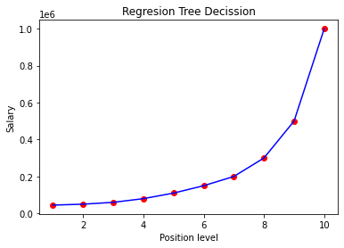

# Decision Tree Regression

## Overview
This project demonstrates how to implement **Decision Tree Regression** using Python and Scikit-Learn. The model is trained on a dataset of position levels and their corresponding salaries, then used to predict salaries for new inputs.

## Technologies Used
- Python
- NumPy
- Pandas
- Matplotlib
- Scikit-Learn

## Dataset
The dataset used is **Position_Salaries.csv**, which contains information about different position levels and their respective salaries.

## Installation
Ensure you have Python installed, then install the required dependencies using:
```bash
pip install numpy pandas matplotlib scikit-learn
```

## Usage
Run the following script to train the Decision Tree model and visualize the results:
```python
import numpy as np
import matplotlib.pyplot as plt
import pandas as pd
from sklearn.tree import DecisionTreeRegressor

# Load the dataset
dataset = pd.read_csv('Position_Salaries.csv')
X = dataset.iloc[:, 1:-1].values
y = dataset.iloc[:, -1]

# Train the Decision Tree Regression model
regression = DecisionTreeRegressor(random_state=0)
regression.fit(X, y)

# Predict a new result
y_pred = regression.predict([[6.5]])
print(f"Predicted salary for level 6.5: {y_pred[0]}")

# Visualizing the results
X_grid = np.arange(min(X), max(X), 0.1)
X_grid = X_grid.reshape((len(X_grid), 1))
plt.scatter(X, y, color='red')
plt.plot(X, regression.predict(X), color='blue')
plt.title('Decision Tree Regression')
plt.xlabel('Position level')
plt.ylabel('Salary')
plt.show()
```

## Output
The script will output a plot showing the Decision Tree Regression results and print the predicted salary for level **6.5**.


